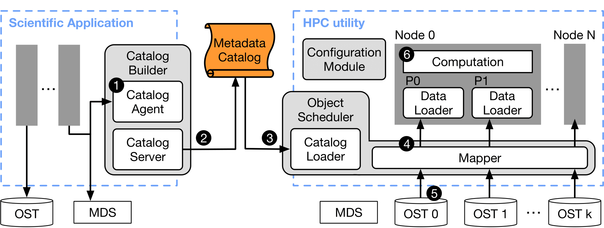
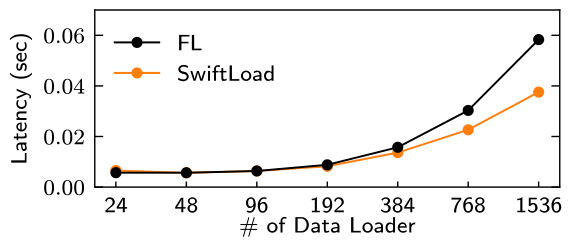

# PRISM: HPC 환경의 I/O 병목 제거를 위한 메타데이터 기반 오브젝트 레벨 스케줄링 미들웨어

## 개요

PRISM은 대규모 HPC 환경에서 발생하는 두 가지 주요 문제: 
1. OST(오브젝트 기반 디스크) 경쟁 
2. 메타데이터 I/O 병목  
을 동시에 해결하기 위한 **오브젝트 단위 I/O 스케줄링 미들웨어**입니다. 본 미들웨어는 **사전에  빌드된 메타데이터 카탈로그**를 활용하여 과도하게 호출되는 디렉토리 순회 시스템콜 및 메타데이터 서버 호출을 제거하고, **로드 밸런스를 고려한 I/O 프로세스 할당**을 통해 OST 경쟁을 최소화합니다.

## 디자인





### 주요 구성 요소

- **메타데이터 카탈로그**  
    파일 경로, `stat`, `lstat`, stripe 정보, OST index 등 오브젝트 IO 스케줄링에 필요한 메타데이터 정보를 포함합니다.
    
- **Catalog Agent/Server**  
    실행 중인 애플리케이션의 `open`, `close` 호출을 가로채어 생성한 파일의  메타데이터를 캐시 계층에 기록합니다 (`LD_PRELOAD` 사용).
    
- **Object Scheduler**  
    카탈로그를 메모리로 로드하여, 각 오브젝트가 어떤 디스크에 배치되어있는지 분석하고 I/O 프로세스를 적절한 OST에 **바인딩**합니다.
    
- **Loader Configuration Module**  
    사전 프로파일링된 OST 성능을 기반으로, 과도한 프로세스 할당을 방지하며 최적의 병렬도 수준을 유지합니다.
    


## 성능 실험 결과




### 1. Deduplication Profiler

- **최대 5.63배**의 성능 향상 (PRISM vs. File-level Scheduling)
    
- 메타데이터 I/O 시간이 거의 제거됨
    
- 데이터 로더 수 증가 시에도 Linear Scalability 유지
    
### 2. Data Augmentation Tool

- **최대 11배** 성능 향상
    
- CIFAR-10 데이터셋 기준, 24개 IO 로더 시 47.8초 → 192개  IO 로더 시 5.3초
    

### 3. 메타데이터 I/O 시간 감소

- File-level: 수십 초 소요
    
- SwiftLoad: 카탈로그 캐시 로딩만 필요 (1초 미만)


## 실행 방법

### 1. 런타임 카탈로그 구축

bash

복사편집
```sh

# 메타데이터 캐시(카탈로그)가 생성될 디렉토리 경로 지정 
export CATALOG_DIR=./catalog 
# LD_PRELOAD를 사용하여 Catalog Agent 삽입 

# 예: 응용례 - 대규모 결과 파일을 생성하는 과학 시뮬레이션 응용
LD_PRELOAD=./libcatalog_agent.so  ./your_application  `

```

### 2. 카탈로그 기반 스케줄링 실행

bash

```

# 환경변수 설정 
export SWIFTLOAD_CATALOG_DIR=./catalog 
mpirun -np <num_processes> ./swiftload_tool --input_dir <data_path>`

```

## Requirement

- Lustre 기반 병렬 파일 시스템
- POSIX I/O 인터페이스
- MPI 기반 Parallel 실행 환경
    

## 참고

- 논문: [Leveraging Pre-Built Catalogs and Object-Level Scheduling to Eliminate I/O Bottlenecks in HPC Environments](https://discos.sogang.ac.kr/file/2025/intl_jour/IEEE_ACCESS_2025_S_Lee.pdf) (IEEE Access 2025 )
    
- 실험 환경: Nurion 슈퍼컴퓨터 (KISTI)
    
- 구현 언어: C/C++
    

## 인용

본 프로젝트 또는 논문을 인용하고자 한다면 다음과 같이 인용해주세요: 


`@article{lee2025swiftload,   title={Leveraging Pre-Built Catalogs and Object-Level Scheduling to Eliminate I/O Bottlenecks in HPC Environments},   author={Seoyeong Lee and Junghwan Park and Yoochan Kim and et al.},   journal={IEEE Access},   year={2025},   doi={10.1109/ACCESS.2025.3553311} }`
